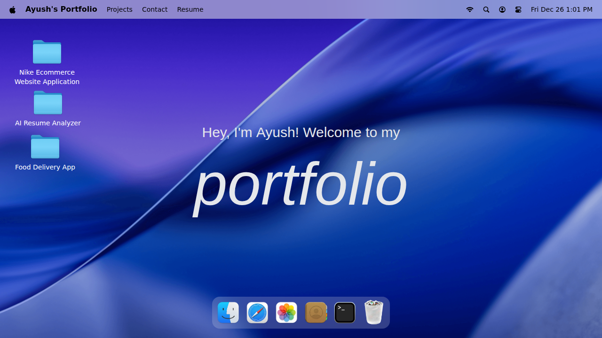

# 🎨 Ayush's Portfolio

A modern, interactive portfolio website showcasing my projects and skills with a beautiful gradient UI design.



## ✨ Features

- **Modern UI/UX**: Clean and professional design with stunning gradient backgrounds
- **Project Showcase**: Display of featured projects including: 
  - Nike Ecommerce Website Application
  - AI Resume Analyzer
  - Food Delivery App
- **Interactive Navigation**: Easy-to-use navigation menu with sections for Projects, Contact, and Resume
- **Responsive Design**: Optimized for all device sizes
- **Smooth Animations**: Engaging user experience with smooth transitions

## 🛠️ Tech Stack

- **JavaScript** (81.2%)
- **CSS** (18%)
- **HTML** (0.8%)

## 🚀 Getting Started

### Prerequisites

- A modern web browser
- Basic knowledge of HTML, CSS, and JavaScript (for customization)

### Installation

1. Clone the repository
```bash
git clone https://github.com/AyushGupta2526/Portfolio.git
```

2. Navigate to the project directory
```bash
cd Portfolio
```

3. Open `index.html` in your browser or use a local server
```bash
# Using Python
python -m http.server 8000

# Using Node.js
npx serve
```

## 📂 Project Structure

```
Portfolio/
├── index.html          # Main HTML file
├── css/               # Stylesheets
├── js/                # JavaScript files
└── assets/            # Images and other assets
```

## 🎯 Featured Projects

1. **Nike Ecommerce Website Application** - A full-featured ecommerce platform
2. **AI Resume Analyzer** - Intelligent resume analysis tool
3. **Food Delivery App** - Modern food ordering application

## 🤝 Contributing

Contributions, issues, and feature requests are welcome! Feel free to check the issues page. 

## 📧 Contact

Ayush Gupta - [@AyushGupta2526](https://github.com/AyushGupta2526)

Project Link: [https://github.com/AyushGupta2526/Portfolio](https://github.com/AyushGupta2526/Portfolio)

## 📝 License

This project is open source and available under the [MIT License](LICENSE).

---

⭐ Star this repo if you like it!
